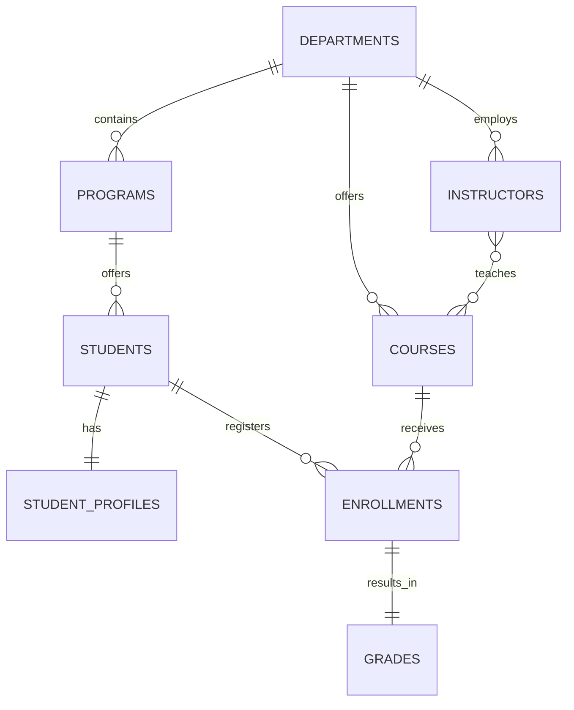

# Student Records Management System (MySQL)

**Assignment:** Question 1 – Build a Complete Database Management System  
**Due:** Wednesday, 25 September 2025 (Africa/Nairobi)

This repository contains a **single MySQL schema (`.sql`)** that creates a complete relational database for a Student Records Management System.

## What the schema includes
- **Tables:** `departments`, `programs`, `students`, `student_profiles`, `instructors`, `courses`, `course_instructors`, `enrollments`, `grades`
- **Constraints:** `PRIMARY KEY`, `FOREIGN KEY`, `UNIQUE`, `NOT NULL`, and `CHECK`
- **Relationships:**
  - One-to-One: `students` ↔ `student_profiles`, `enrollments` ↔ `grades`
  - One-to-Many: `departments` → `programs`, `programs` → `students`, `departments` → `courses`, `departments` → `instructors`
  - Many-to-Many: `students` ↔ `courses` via `enrollments`; `instructors` ↔ `courses` via `course_instructors`

## ER Diagram (Mermaid)
> GitHub renders Mermaid diagrams automatically.



## How to run locally
1. Open **MySQL Workbench** (or mysql CLI).  
2. File → Open SQL Script → select `student_records_db.sql`.  
3. Click **Run**.  
4. Verify with:
   ```sql
   USE student_records_db;
   SHOW TABLES;
   ```

> The script includes an **optional seed data** section (commented out). Uncomment it only if your lecturer allows test data.

## Submission
- Upload `student_records_db.sql` to your **own public GitHub repository** and submit the repo link.

## Environment
- MySQL **8.0+**
- Storage engine: **InnoDB**
- Charset: **utf8mb4**

---

**Author:** Assani Ndaka
